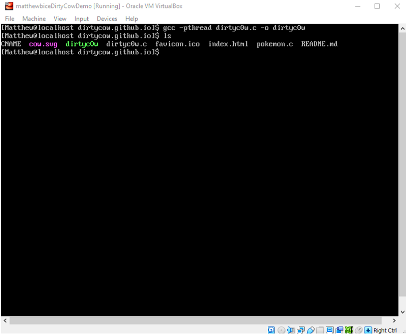

# Introduction

Up until this point, all my lab work on the virtual machine has been done on the “root” account. This is also considered the “superuser” account and has total and unbounded access to all files, systems, and processes. Since I am the machine’s only physical user, this is perfectly fine since being the root user gives me all the freedom I need to complete my labs. However, suppose other people were able to use my system. If that were the case, I would not want to give them unfettered access to change and modify all of the files on my system. This is where permissions come in. I can create user accounts for these people and give them just enough access so that they can complete all their tasks without the risk of messing with crucial files. Additionally, I can also totally lock out users who should not have access to certain files. This is what the first part of the lab will address: How to add users on the system and modify permissions so that their access is limited only to what they need.

The second part of the lab addresses an infamous Linux exploit known as Dirty Cow. It is a program that can modify crucial files in the system to escalate a non-root user so that he or she has root privileges. I will be demonstrating how it can modify files the actual root user made and even worse, how it can give a non-root user the status of root user.

# Basic User Account Management

## Creating Two New User Accounts

For this first section of the lab, I will be creating two new non-root user accounts. As such, they will only have limited access to editing and files. To begin, I first use the command “useradd” to add the new users, “Alice”, and “Bob”. I then use the “passwd” command to set the passwords for the two new accounts. For simplicity their passwords will be “Alice” and “Bob” respectively. Next, the directions indicate that both accounts belong to their own group which is named after their respective account names. Therefore, for Alice, I use the commands “usermod Alice -aG Alice” and “usermod Bob -aG Bob” respectively. In these commands, “usermod” command modifies a user’s properties, and the “-a” and “-G” options combined add the user account to a new group. To check, I use the “id” command to check the properties of the two new accounts. The output indicates that there is a user “Alice” with GID = 1000 in the group “Alice”, and a user “Bob” with GID = 1001 in the group “Bob”. Given this information, I conclude that this section was performed successfully.

## Creating a New User Group and Shared Folder

Although these two accounts have been created with their own unique groups, the directions now indicate that they will be working together on a Smart Car project. As such, there will need to be a common group in which they can share files and folders. To begin, I use the command “groupadd” to add a new group named “smartCarProject”. Then, similarly to the previous step, I use the command “usermod [Alice/Bob] -aG smartCarProject” to add the two accounts to the new group. Once again, I use the “id” command to verify that both Alice and Bob are added to GID = 1002(smartCarProject). They are, and I am ready to begin the next half of this section.

With the users added to the smartCarProject group, I must now create a shared folder with the directory “/tmp/smartcar” so that the two users can share their work. While still logged on as the “root” user, I use the command “cd /tmp/” to change to working directory to the “tmp” folder. Then, I simply use the command “mkdir smartcar” to create a new folder in the “tmp” directory. I now have a basic instance of the “smartcar” folder, but some modifications to its permissions are needed.

### Modifying the Shared Folder's Permissions

The folder has been created but using the command “ls -ald” shows that the folder can be accessed and written by anyone. The objective here is to set the folder’s permissions so that the “smartcar” folder is inaccessible to all non-root users except Alice and Bob, and Alice and Bob can only read each other’s files and not write or remove them. To do so, I will be using the “chmod” command. However, I will have to consider exactly which octal value I want to enter so that the permissions I set coincide with the directions. The value 770 seems most suitable since it allows access for the directory’s owner and group members and denies outside members. Finally, I use the command “chown :smartCarProject smartcar” to change the smartcar directory’s owner(s) to the group and its members.

## Testing and Verifying that the Permissions are Set Correctly -- Outside User

To best check whether the permissions have been properly set, I will attempt perform some actions on the directory that are supposed to be outside of its permission limits. First, I will create another non-root user and not add it to any group. The name of the account will be “Cooper”, and its password will be “Cooper”. With this done, I use the command “su Cooper” to switch to the Cooper user. From there, I change the working directory to the “tmp” folder and attempt to do the following: First, I attempt to access the “smartcar” folder with the “cd” command. The output tells me that permission is denied. Then, I attempt to remove the directory with “rm -r smartcar”. Despite asking a few prompts, the resulting output states that the operation is not permitted. As the following figure shows, I conclude that I have successfully locked out non-root users outside of the “smartCarProject” group from accessing or modifying the ”smartcar” folder.

- _Figure 1_: Here, I first verify that user Cooper has been added, then login as Cooper. Then, I change the directory so that I am in the /tmp/ folder. I then attempt to access the “smartcar” folder with cd followed by trying to delete the folder altogether. The resulting outputs indicate that these actions are not permitted.

  

## Testing and Verifying that the Permissions are Set Correctly -- Bob's Permissions

The previous section has shown that permission has been successfully denied for outside users. However, I still need to make sure that the users who are in the group also have the proper permissions. To do so, I will first be switching to a new terminal and logging in as Bob. Using alt + the right arrow key, I access a new terminal and login as Bob. After logging in, I have found that I can access the smartcar directory, but I am unable to modify its permissions.

- _Figure 2_: Logging into a second terminal as Bob. I then change the working directory to /tmp/ and attempt to access the smartcar directory. Unlike the previous section, I am allowed access. However, after once again accessing the /tmp/ directory, I have found that I cannot change the directory’s permissions.

  

## Testing and Verifying that the Permissions are Set Correctly -- Alice's Permissions

For this section, I follow the same steps in the previous section except I now login as Alice. The same results as the previous section follow.

- _Figure 3_: Logging into a third terminal as Alice. Once again, after following the same steps in the previous section, I found that I can access the smartcar directory, but am unable to change its permissions.

  

Given these results, I therefore conclude that the permissions for the smartcar directory have been successfully and properly set.

# A Taste of Privilege Escalation (CVE-2016-5195)

## Creating the New Virtual Machine

In this part of the lab, I will be intentionally exploiting a vulnerability found in an earlier version of the Linux kernel in order to demonstrate privilege escalation. However, I cannot do this on my current virtual machine since the exploit has since been patched. As such, I will have to create a new virtual machine that is running and earlier version of the Linux kernel.

This section follows the same steps that were taken in the first part of Lab 1. To begin, on the VirtualBox home page, I hit the “new” button and decide a name for my new virtual machine. I wanted to follow the naming conventions that were covered in the first lab, but also wanted to clarify that this is not the main machine. As such, the name for the machine will be “matthewbiceDirtyCowDemo”. Per the instruction’s recommendations, I set the machine’s RAM to 2 GB and its hard disk space to 10 GB. Once this is done, the machine is successfully created.

## Installing an Earlier Version of CentOS

The new virtual machine has been created, but if I want the exploit to work, I will have to use an earlier version of CentOS. The directions explain that the exploit only resides in the Linux kernel versions ranging from 2.6.22 to 3.10.0-327. Using the “uname -r” command, which display’s the kernel’s version number, on my main virtual machine shows that the kernel it is using is version 3.10.0-957. This means that my machine is using a newer kernel version which therefore means that the exploit has been patched. This therefore necessitates the use of an earlier CentOS release.

Once starting up my new virtual machine, a prompt asks me what optical disk image I wish to use for the machine. The version of CentOS I use for my main machine is there, but I will need to load in the older version I just downloaded myself. After doing so, I am taken to a home screen where I have the option to install CentOS 7. I select it, and the machine goes through the process of implementing the operating system. Then, once again, I follow the same steps I took in Lab 1 to complete the configuration process. 

## Preparing the System

The virtual machine has been created and the older OS has been successfully installed (_Figure 5_ will prove this). Now it is time to set the stage for the Dirty Cow exploit. This section will be broken down into smaller subsections to emphasize each step in this stage of the lab.

### Creating a new non-root user

I begin by creating a new non-root user using my own name with the command “useradd Matthew”. Next, as I have done for the other user accounts, I set the password. In keeping with my naming conventions, the password will also be “Matthew”. The prompt tells me that all authentication tokens for the account updated successfully, and I double check with the command “id Matthew” to ensure that “Matthew” is a recognized user.

- _Figure 4_: The creation of the “Matthew” account. I follow the same steps I took earlier for Alice, Bob, and Cooper by setting the user’s name, then password. As mentioned, the password for the account is “Matthew”. Once the machine accepts the password, I use the “id” command to view the properties of the new account. The displayed user ID value is equal to 1000 which therefore means that the new user is a not a special system user (i.e., root user) in addition to being the first normal user added onto the system.

  

### Validating the Linux kernel version

The next step, per the instructions, is to double check that the kernel version I am using is within the range of versions that contain the Dirty Cow exploit. To do so, I use the command “uname -r”. The command “uname” “determine[s] the processor architecture, the system hostname, and the version of the kernel running on the system” and the “-r” option “[p]rints the kernel name” (Linuxize). This means that the uname command will be called, but only the kernel version will be printed in the output as shown below:

- _Figure 5_: Using the command “uname -r” to display the kernel version. The output indicates that the kernel version is 3.10.0-123. Though close, this is still within the range of 2.6.22 to 3.10.0-327 which therefore means that this version of the kernel has the Dirty Cow vulnerability, and this portion of the lab was a success.

  

### Installing GCC and Git

This subsection of the lab mandates the installation of two programs: GCC and Git. GCC, or GNU Compiler Collection, acts as “the compiler for the GNU operating system” (GCC), and “Git is a fast, scalable, distributed revision control system” (Git). In other words, it acts as a changelog developers can use to show modifications or updates to their programs and provides developers with the ability to provide users the option to download older versions of their software. 

To install the software, I will be using yum as I have with any other installation. Initially, I used the command “yum install -y gcc” to install GCC, but the installer failed and aborted the operation. After some time of trial and error, I discovered that I missed a crucial step in setting up the virtual machine. I had forgot to configure its network settings so that it can connect to the Internet. After changing the ifcfg-enp0s3 script’s ONBOOT file from “no” to “yes,” I reboot the machine and try again. This time, the program successfully installs. I do the same steps (minus the network configuration) to install Git by using the command “yum install -y git”. In the end, both programs were installed successfully.

### Creating and adding "rootfile" to the non-root user's home directory

In this section, I use a few basic Linux commands to access user Matthew’s home directory, create a new file in the directory, and add content to the file. To do so, as the root user, I use the command “cd /home/” to change the working directory to the folder that stores non-root users’ home directories. Then, I use the command “ls” to verify that user Matthew’s home directory is there, then again use “cd” to change the working directory to /home/Matthew. Now I use the “touch” command to create a new file named “rootfile”, and the “echo” command to add content to rootfile. Finally, to verify that that everything worked, I used the command “cat rootfile” to display the contents of rootfile, and the “ls” command to verify that rootfile is in the right place. Below is a figure displaying the steps executed in this order. With this final step completed, the stage is now set for an invader to execute the exploit.

- _Figure 6_: The command prompt with the commands I entered to complete this step. Notice the dark blue text in the entry in /home/ which indicates that it is a folder. Also note that I remain as the root user throughout this process and as such, the file I create can only be edited by the root user.

  

## Preparing the Invader (Non-root User)

The system is fully set up and now the invader can begin his attack. As the section title implies, the “invader” is referring to user Matthew. This section will be done from the perspective of the invader and cover the steps he would take to prepare for execute the Dirty Cow exploit. Once again, this section will be broken into smaller subsections.

### Acquiring the Dirty Cow exploit

The exploit in question exists as a file found in a git repository in Github. To get it, I will need to use Git’s “clone” command to copy the exploit’s repository to a new directory (Git). I initially enter the command “git clone” with the repository address found in the directions but am given a fatal error. Using the “yum update -y nss curl libcurl” command, I update my machine’s libraries. After doing this, running the command again yields a successful cloning.

- _Figure 7_: Cloning the Github repository onto my machine. Not pictured is the initial login prompt and the error I got when initially entering the clone command and the output after executing yum’s update command. The output implies all files were successfully retrieved from the Internet.

  

### Discussing permissions of the files

Currently, rootfile cannot be edited by the non-root user. I proved this by attempting to add an extra line of text to the file with the echo command. The output tells me that permission is denied which therefore leads me to conclude that non-root users do not have the ability to access files created by the root user.

A non-root user cannot edit the file because of the permissions set on rootfile. Using the command “ls -l”, I can display contents of a folder along with their permissions. The permission configuration for rootfile is as follows (Note that this can also be found in Figure 8):

  

For better understanding, I have color-coded the sections in the file’s permission. Green indicates the root user’s permissions, yellow indicates the permissions for a user in a group assigned to the file, and red indicates the permissions of all other users. Before that, however, is a dash. This dash indicates that rootfile is a regular file. Next, I should clarify that permission configurations for users are represented with four possible characters: r, w, x, and a dash. The r means that the user can read the file. This means that commands like “cat” can be used to view the contents of the file. The w means that the file is writable to the user. In other words, the user can edit the contents of the file. The x decides whether a user can execute the file. In this case, however, the file is a plaintext file and therefore there is nothing to execute. Finally, the dash indicates that this permission is not available to the user.

So, then, we can now analyze the permissions of rootfile. First, the permission says that the root user can read and write (edit) the file (again, there is no execute permission since the file cannot be executed). Next, it says that users in a group that is assigned to the file are only able to read its contents. Finally, it similarly states that all other users can only read the contents. User Matthew is a non-root user, and there is no group assigned to the file. Therefore, he must be an outside user (so he falls under “all users” in the red). Because of the permission r-- , he is only able to read the file and not edit it.

Next, we will look at the dirtypig folder:

  

The only thing to add here is the “d” character at the beginning which replaces the dash seen in rootfile. This only means that the permission is referring to a folder. This adds up since dirtypig is a folder as is indicated in Figure 8 where it is written in blue text (which means it is a folder).

As for the rest of the permission, we see that root users can read the file, write it, and execute it. Next, users in an associated group can also read, write, and execute the file. Finally, and interestingly enough, all other users can read and execute the file, but not write it. Given these permissions, I see that user Matthew has little power over rootfile, but enough freedom to cause some havoc with dirtypig.

- _Figure 8_: Viewing and confirming the permissions of the files in user Matthew’s home directory. Notice that dirtycow is displayed in blue text which indicates that it is a folder. After locating rootfile, I attempt to edit it with the echo command but am denied. I then use command “ls -l” to view the contents of the directory along with their permissions. Finally, I use the “cat” command to prove that user Matthew is at least able to read rootfile.

  

## Compiling the Dirt Cow Program and Escalating Privileges

As the invader, my target has become clear, and I am ready to execute the Dirty Cow exploit. First, however, I must compile my program using GCC. To do so, I will need to use the command “gcc -pthread dirtyc0w.c -o dirtyc0w”. In doing so, I compile the Dirty Cow program written in C into an executable file named “dirtyc0w”. The figure below shows this process:

- _Figure 9_: Compiling the Dirty Cow source code. I compile the code with the command, then use “ls” to display the contents of the cloned folder to ensure that a new executable file (shown in green) was created. The pink entry is possibly from an initial failed attempt I made.

  

With the Dirty Cow executable ready to fire, I can now use it to escalate my privileges and edit rootfile. Using the command “./dirtyc0w ~/rootfile ‘hahaha this file has been overwriiten’, I make the Dirty Cow program target rootfile and overwrite its contents with what I wrote in the quotations. Immediately after, an mmap address is printed, some extra output is expelled, and the whole machine reboots. Luckily, I managed to capture the mmap address before it did.

- _Figure 10_: Using the Dirty Cow program to overwrite rootfile. In the third line, the command is entered along with the text I wanted to use to replace the contents of rootfile. Then, an mmap address is printed. Since this is a valid address, and is not “ffffffffffff”, I suspect the procedure was a success. This will be proven in the next figure.

  

- _Figure 11_: Proof of Dirty Cow success. However, it was not easy to capture this image due to the system restart that would occur shortly after. I suspect this is a security measure CentOS has against the exploit since a system restart completely undoes any edits made with Dirty Cow. Nevertheless, if I move fast enough, I can see that rootfile was successfully overwritten. However, the output seems to be cut off.

  

## Extending the Usage of Dirty Cow

With the ability to overwrite root files, I imagine that the Dirty Cow exploit has the potential to do some serious damage. Sure enough, after looking at the list of other uses of Dirty Cow, it can. The one that stood out to me the most was the exploit that would find the current user and change its user ID to 0 which would thereby make it a root user. This would mean that the user would have root permissions on all files! To see this in action, I follow the steps I took in section IV subsection 1 to clone the repository onto my machine. Once that is done, I continue by compiling the code in my newly cloned folder. Before that, however, I find that the name of the new directory is terribly long with random letters and numbers. Using the “mv” command, I rename the folder to “dirtycowpasswd”. Now I can compile the code and I do so with GCC and name the file “dirtycowpasswd”. With this done, I use the command in section V to execute the program and change my user ID. The program is a success and the system restarts. This makes me conclude that the system restart is indeed a security measure. The figure below shows a capture before the machine rebooted.

- _Figure 12_: Using the id command on user Matthew as the root user. In doing so, I find that Matthew has a UID of 0 which would thereby make him a root user as well! Comparing this to _Figure 4_, I see that a non-root user has indeed escalated himself to a root user. I imagine this would be one of a system administrator’s worst nightmares!

# Conclusion

This lab was a thorough demonstration of how permissions work in Linux and I now feel that I have a much better understanding than I did when I was initially starting the chapter. Throughout the lab, I found three limitations: The first, and most significant, is the massive download time the older CentOS disk image had which greatly hindered progress. The second is the security measure CentOS has which causes the system to reboot when the Dirty Cow programs were executed. Finally, the third limitation is how the content of the overwritten rootfile is cut off. The lab also made me more aware of the dangers of exploits like Dirty Cow and how programmers and administrators must stay informed and up to date with their systems if they wish to catch and prevent exploits like this one. After this lab, I would say that I am now more prepared to handle users and better moderate their access should they choose to use my system.

# References

- <a href="https://git-scm.com/book/en/v2/Git-Basics-Getting-a-Git-Repository" target="_blank">2.1 Git Basics - Getting a Git Repository.</a> Git

- <a href="https://chmodcommand.com/chmod-770/" target="_blank">Chmod 770.</a> CHMOD Calculator. Accessed November 22, 2021.

- <a href="https://gcc.gnu.org/" target="_blank">GCC, the GNU Compiler Collection.</a> GCC, the GNU Compiler Collection - GNU Project

- <a href="https://git-scm.com/docs/git" target="_blank">Git Documentation.</a> Git

- <a href="https://linuxize.com/post/uname-command-in-linux/" target="_blank">Uname Command in Linux.</a> Linuxize
